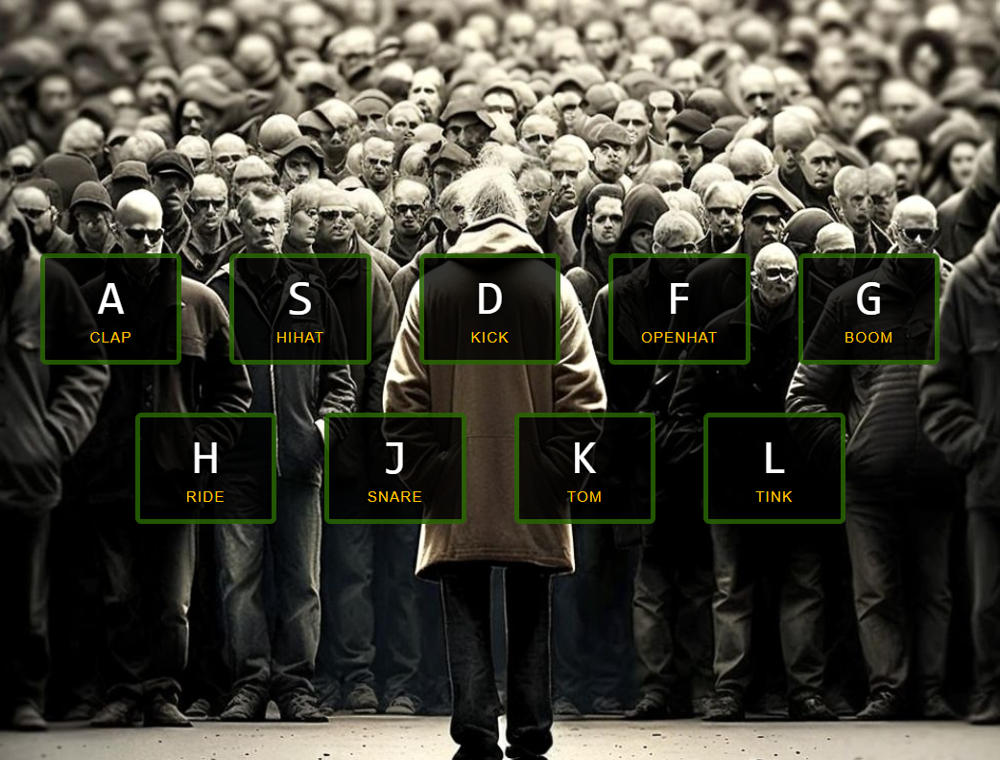

# Day 01 – Drum Kit 🥁

🎧 [Live Demo](https://icabduqaadir12.github.io/javascript30-demos/01-drum-kit/)

A virtual drum kit powered by keyboard and mouse events.

## 🧩 What I Learned
- Handling `keydown` events
- Using `data-*` attributes
- CSS transitions & JS animation cleanup

## ✨ Features I Added
- Mouse click support
- Custom styling & spacing
- Responsive layout

## 🗂️ Files
- `index.html`
- `style.css`
- `script.js`
