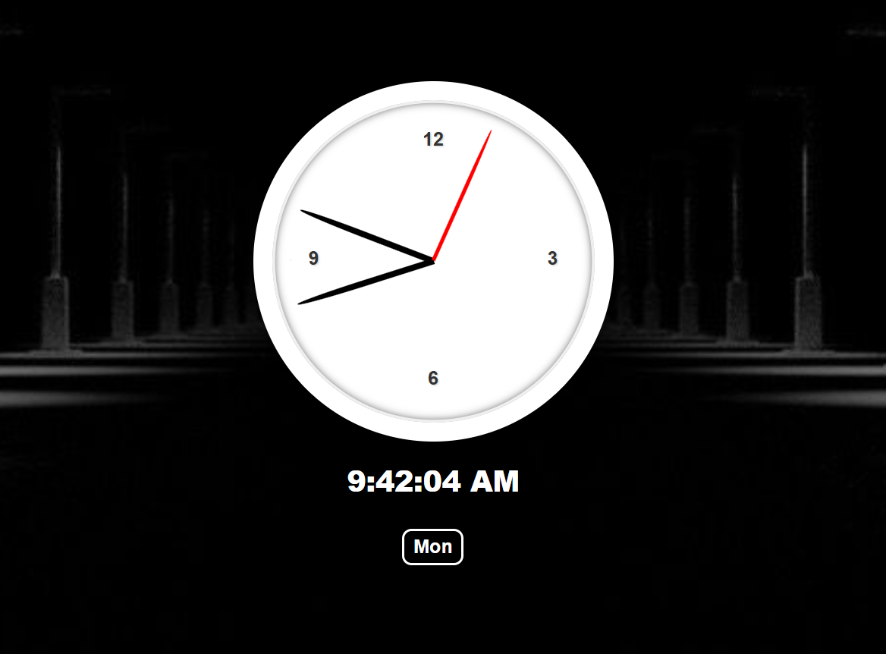

# Day 02 – JavaScript Clock ⏰

🕒 [Live Demo](https://icabduqaadir12.github.io/javascript30-demos/02-clock/)

A functional analog clock powered by JavaScript.

## 🧩 What I Learned
- Using `Date()` for time
- Rotating hands with transform
- Handling 90° offset and transition bugs

## ✨ Features I Added
- Digital time display
- Responsive circular layout
- Smooth animation fix at 0s

## 🗂️ Files
- `index.html`
- `style.css`
- `script.js`
