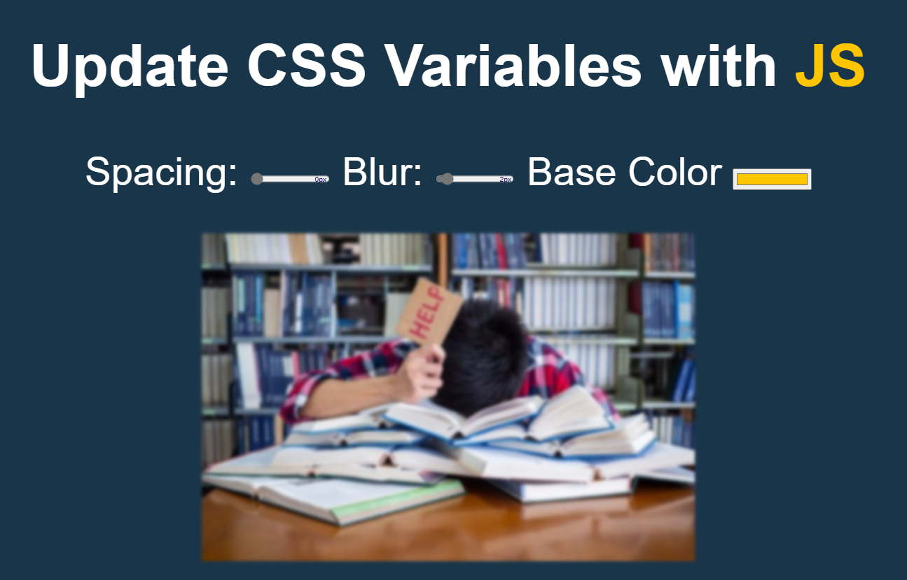

# Day 02 – JavaScript Clock ⏰

🕒 [Live Demo](https://icabduqaadir12.github.io/javascript30-demos/02-css-variables/)

# 🎨 CSS Variables with JavaScript

A small project demonstrating how to update CSS custom properties (`--variables`) dynamically using JavaScript.

## 🧠 What I Learned
- How to use `dataset` attributes to pass units like `px`
- Updating CSS variables with `document.documentElement.style.setProperty`
- Accessing and modifying input values in real-time

## 💡 Features I Added
- Live display of each input’s current value (e.g., `10px`) except base
- Improved event handling using the `input` event
- Cleaner and more responsive UI feedback

## 🗂️ Files
- `index.html`
- `style.css`
- `script.js`

