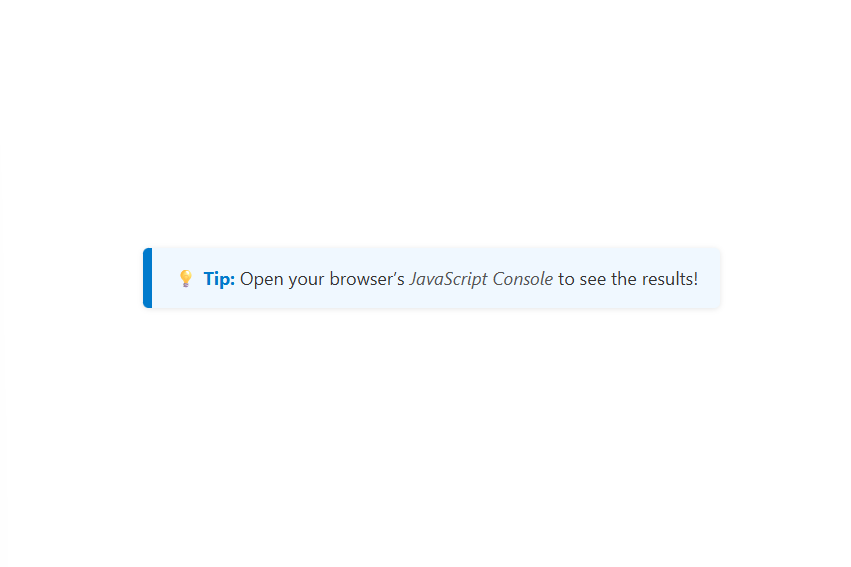

# Day 04 – Array Cardio Day 1 💪

📊 [Live Demo](https://icabduqaadir12.github.io/javascript30-demos/04-array-cardio-1/)

# 🧮 Array Methods Practice

A collection of small challenges focused on mastering powerful JavaScript array methods like `.filter()`, `.map()`, `.sort()`, and `.reduce()` using real-world datasets.

## 🧠 What I Learned
- Filtering arrays based on conditions
- Mapping arrays to transform data
- Sorting objects by values (dates, string names, calculated age)
- Reducing arrays to single values (sums, tallies)
- Using `localeCompare()` for string sorting

## 💡 Features I Added
- Rewrote all functions using modern arrow syntax
- Replaced ternary sort with `localeCompare()` for robust name sorting
- Improved sorting by age with cleaner arithmetic
- Handled DOM fallback in the “Boulevard” challenge
- Used concise conditions and better readability throughout

## 🗂️ Files
- `index.html`
- `style.css`
- `script.js